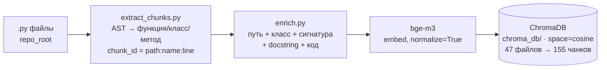
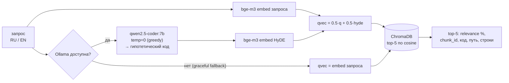

# CodeLens — семантический поиск по Python-коду (RU + EN)

Задаёшь вопрос на естественном языке (русском или английском) — система возвращает
top-5 наиболее релевантных фрагментов кода (функция / класс / метод) с подсветкой
синтаксиса, процентом релевантности и точным `chunk_id`. Решение Кейса 3 «CodeLens RAG»
(2-й этап чемпионата ГК «Ростелеком», направление ИИ).

**Метрика (headline):** Precision@5 = **0.800** на официальном `eval_questions.json` (15 вопросов,
человеческая разметка). На расширенном наборе combined-269 — **0.890** (robustness-проверка; набор
на 94 % синтетический и инфлирует lexical-методы, поэтому используется только как агрегат-довесок,
не для срезов — см. §5). Тёплая latency ретрива ≈ **27 мс** (p50). Всё детерминировано
(HyDE temperature=0, greedy).

---

## 1. Архитектура

Гранулярность чанка — **одна функция / класс / метод**, извлекаемая детерминированным
AST-обходом. Текст, который реально эмбеддится, — не голый код, а **обогащённый**
(путь файла, родительский класс, сигнатура, docstring, затем код): это закрывает разрыв
«вопрос на естественном языке ↔ имена в коде». На стороне запроса работает **HyDE**:
локальная LLM генерирует гипотетический Python-код по вопросу, его эмбеддинг усредняется
с эмбеддингом запроса (mix, равные веса) — так RU/EN-вопрос приближается к коду в едином
векторном пространстве. Хранилище — **ChromaDB** (косинусное пространство).

### Индексация (`python index.py <папка>`)



### Поиск (`search.py`, используется в `app.py`)



### Компоненты

| Файл | Роль |
|---|---|
| [extract_chunks.py](extract_chunks.py) | Корректный AST-экстрактор. Чанк = функция/класс/метод; `chunk_id = {path}:{name}:{start_line}`, для метода `name = ClassName.method`. Ручная рекурсия `iter_child_nodes` (не `ast.walk`) — без задвоения методов. |
| [enrich.py](enrich.py) | Канонический enrichment чанка (путь + класс-родитель + сигнатура + docstring + код). Единственный источник правды; его переиспользуют и индексатор, и эксперименты. |
| [index.py](index.py) | Строит коллекцию ChromaDB: `обход .py → extract_chunks → enrich → bge-m3 → ChromaDB`. Идемпотентен (пересоздаёт коллекцию). |
| [search.py](search.py) | Боевое поисковое ядро: `search(query, top_k=5, use_hyde=True)`. HyDE temp=0 + mix, graceful fallback при недоступной Ollama, кэш HyDE-генераций, разбивка latency. |
| [app.py](app.py) | Streamlit-UI: вкладка 🔎 Поиск (карточки с `st.code(language="python")`, relevance %, latency) и вкладка 📊 Метрики (живой прогон P@5 + срезы). |

**Модели:** эмбеддинги — `BAAI/bge-m3` (мультиязычная, код-aware); HyDE/LLM — `qwen2.5-coder:7b`
через локальную Ollama. Векторная БД — ChromaDB (persistent, `chroma_db/`, `hnsw:space=cosine`).

### Режимы индексации (две изолированные коллекции)

База разнесена на **две физически изолированные коллекции ChromaDB**:

| Коллекция | Содержимое | Назначение |
|---|---|---|
| `codelens_gymhero` | gymhero (47 файлов, 155 чанков) | **Официальный корпус. По нему считается метрика P@5.** |
| `codelens_extra` | click, rich, JS/Java-демо (121 файл, 1627 чанков) | Размер базы (≥80 файлов ТЗ) + мультипроектный поиск |

> 168 — файлов кода на диске (как считает `index.py`). На странице метрик UI показывает
> 128 — это файлы с ≥1 чанком (пустые `__init__.py` без функций/классов в индекс не попадают).
> Оба числа кратно превышают порог ТЗ ≥80.

Зачем разделение: **официальный eval организаторов размечен только по gymhero** (все
эталонные `chunk_id` указывают на `gymhero/...`), поэтому корректная область подсчёта
метрики — именно gymhero-коллекция. Чанк из другого проекта **по определению бенчмарка не
может быть правильным ответом**. Если же индексировать всё в одну коллекцию, доменно-близкие
чанки из других проектов (например JS/Java-реализация той же аутентификации) вытесняют
эталонные gymhero-ответы из топ-5 и роняют P@5 (**cross-project dilution**, −0.144 на офиц.15;
числа и анализ — в [REPORT.md](REPORT.md), раздел «Режимы индексации»). Изоляция коллекций
устраняет это: официальная метрика считается строго по `codelens_gymhero` и **не зависит от
размера общей базы**, а требование «≥80 файлов» закрывается суммой обеих коллекций (168 файлов).

`python index.py` (без аргументов) строит **обе** коллекции раздельно; маршрутизация жёсткая
(gymhero → `codelens_gymhero`, любая другая папка → `codelens_extra`), поэтому официальную
коллекцию невозможно случайно «разбавить». В UI переключатель **«Область поиска»** выбирает
`Только gymhero` (официальный режим, метрика 0.800) или `Вся база ≥80 файлов`.

#### Пользовательские репозитории (вкладка «📦 Репозитории»)

Помимо встроенного корпуса, в `codelens_extra` можно добавлять **произвольные публичные
GitHub-репозитории** — через вкладку «📦 Репозитории» (поле ссылки → «Добавить») или пакетно
файлом `repos.txt` (`python add_repo.py --file repos.txt`). Репо клонируется (`git clone
--depth 1`, с zip-фолбэком), индексируется тем же ядром (`extract_chunks` + `enrich` + bge-m3)
и помечается `source=owner__repo`, `origin="user"`. Поиск по такому репо идёт строго по нему
(`where={"source": ...}`), есть удаление по одному и LLM-режим.

**Граница владения (важно для воспроизводимости):** встроенный extra-корпус (click/rich/JS/Java)
управляется `index.py`; пользовательские репозитории — через вкладку «Репозитории» (и
`add_repo.py`), и **переживают переиндексацию** — `python index.py` пересоздаёт только
встроенную часть (`origin != "user"`), не трогая user-репо. Запись пользовательских репозиториев
идёт **только** в `codelens_extra` (жёстко закодировано); официальная gymhero-коллекция и
метрика 0.800 от них не зависят.

---

## 2. Запуск (две команды)

**Окружение** — Python 3.12 (conda env `codelens`):

```bash
conda create -n codelens python=3.12 -y
conda activate codelens
pip install -r requirements.txt
```

**Команда 1 — индексация** (строит ChromaDB; без аргументов — обе коллекции):

```bash
python index.py                # обе коллекции: codelens_gymhero (47ф/155ч) + codelens_extra (121ф/1627ч) = 168 файлов
# python index.py gymhero      # только официальная коллекция (быстрее; метрика считается по ней)
# python index.py <папка> ...  # произвольная папка → попадает в codelens_extra, gymhero не затрагивается
```

**Команда 2 — приложение** (поднимает UI с поиском и страницей метрик):

```bash
streamlit run app.py
```

Заметки:
- **Модели качаются при первом запуске** в `~/.cache/huggingface/` (bge-m3 ≈ 2.3 ГБ).
  Прогрейте заранее, не в момент демо.
- **HyDE** требует запущенной Ollama с `qwen2.5-coder:7b` (`ollama pull qwen2.5-coder:7b`).
  Если Ollama недоступна — поиск **не падает**: `search.py` делает graceful fallback на
  эмбеддинг только запроса (без HyDE).
- `sslfix.py` импортируется первым в `index.py`/`search.py` и автоматически чинит битый
  `SSL_CERT_FILE` (иначе на части окружений падает загрузка моделей с HuggingFace).

---

## 3. Пять примеров запросов (реальные прогоны `search()`)

Все результаты ниже получены боевым `search(use_hyde=True)` на текущей базе (HyDE temp=0).

**1. RU · easy — «где хранится секретный ключ для подписи токенов?»**
```
1. [65.3%]  gymhero/api/dependencies.py:get_token:35      (function)
2. [62.8%]  gymhero/schemas/auth.py:Token:6               (class)
```

**2. RU · medium — «как проверить, активен ли пользователь?»**
```
1. [85.1%]  gymhero/crud/user.py:UserCRUDRepository.is_active_user:38   (method)
2. [73.7%]  gymhero/api/dependencies.py:get_current_active_user:82      (function)
```

**3. RU · hard — «как устроена цепочка зависимостей при проверке прав суперпользователя на уровне роутера?»**
```
1. [70.0%]  gymhero/crud/user.py:UserCRUDRepository.is_super_user:25    (method)
2. [67.9%]  gymhero/api/dependencies.py:get_current_superuser:105       (function)
```

**4. EN · medium — «how to create a new training plan?»**
```
1. [76.9%]  gymhero/crud/training_plan.py:TrainingPlanCRUD.add_training_unit_to_training_plan:11  (method)
2. [76.7%]  gymhero/crud/training_plan.py:TrainingPlanCRUD:10                                      (class)
```

**5. EN · негативный — «is there any rate limiting or throttling mechanism implemented?»**
```
1. [55.2%]  gymhero/crud/base.py:CRUDRepository.get_many_for_owner:189  (method)
2. [55.0%]  gymhero/crud/base.py:CRUDRepository.get_many:53             (method)
```
В `gymhero` rate limiting **не реализован**. Порог `NEGATIVE_THRESHOLD = 60 %` в
[search.py](search.py) ловит это: top-1 = 55.2 % < 60 % → UI показывает баннер «низкая
релевантность — возможно, функциональности нет в коде». Система не выдумывает фичу, а честно
помечает свой лучший (но слабый) ближайший по смыслу результат.

**Калибровка порога — на данных и только на человеческом наборе** (официальные 15 +
`sample_queries`, не на синтетике). Собрали top-1 relevance живым `search` (temp=0, source=gymhero):

| Группа | n | min | медиана | max |
|---|---:|---:|---:|---:|
| Позитивы — официальные 15 | 15 | 62.8 | 72.8 | 83.4 |
| Позитивы — sample (1–16, чистые) | 16 | 65.3 | 71.6 | 85.1 |
| Негативы — sample + «кеширование»¹ | 4 | 54.6 | 56.2 | 58.4 |

¹ Запрос *«как реализовано кеширование ответов API»* (57.2 %) размечен позитивом, но кеширования
в gymhero **нет** — это скрытый 4-й негатив; относим к негативам. **Зазор чистый: негативы ≤ 58.4 %,
пол истинных позитивов = 62.8 %** (floor не сдвинулся относительно прежней калибровки).

Порог **T = 60 %** стоит в середине этого зазора. Confusion-матрица (31 позитив + 4 негатива):

| Истина \ Решение системы | показала результат | «не найдено» |
| --- | :---: | :---: |
| **ответ в базе ЕСТЬ** (31) | 31 ✓ | 0 |
| **функции НЕТ** (4, вкл. «кеширование») | 0 | 4 ✓ |

То есть T=60 ловит **все негативы (4/4)** при **нуле ложных «не найдено»** на истинных позитивах, и
остаётся ниже самого слабого легитимного позитива (официальный пол 62.8 %) — порог обобщается, а не
подогнан под демо. Прежнее значение 40 % было ниже негативов и баннер не срабатывал вовсе.

---

## 4. Обоснование стратегии чанкинга

> Чанк = одна функция/класс/метод, потому что это минимальная самостоятельная семантическая
> единица Python-кода: у неё есть имя, сигнатура и docstring, она индексируется AST
> детерминированно и совпадает с гранулярностью, в которой разработчик задаёт вопрос
> («где проверяется суперпользователь»). Крупные функции мы дополнительно обогащаем
> сигнатурой и контекстом; файловую гранулярность отвергли — она смешивает несколько
> ответственностей в один вектор и роняет precision.

AST-детерминизм — не просто удобство: экстрактор из [extract_chunks.py](extract_chunks.py)
даёт **дельту 0 строк на всех 30 эталонных `chunk_id`** из `eval_questions.json` (калибровка
30/30), то есть формат `chunk_id` гарантированно совместим со скорером организаторов. Выбор
function-level + enrichment подтверждён экспериментом: enrichment — **единственный
статистически значимый прирост** в ablation (см. §6 и research report).

---

## 5. Метрики

Считаются скрипт-совместимо с организаторским [score.py](score.py)
(`Precision@5 = matched / min(5, len(correct))`, сравнение `chunk_id` с допуском ±2 строки).

| Набор | Вопросов | Precision@5 |
|---|---:|---:|
| **Официальный (headline)** `eval_questions.json` (организаторы) | 15 | **0.800** |
| Combined (robustness) `eval/eval_combined.json` | 269 | 0.890 |

> Combined-269 = 15 официальных + 254 LLM-сгенерированных (`gen_eval`). Это **robustness-проверка
> одного агрегата**, а не источник выводов: синтетические вопросы инфлируют lexical-методы
> (надувают reranking, размывают enrichment — доказано per-subset bootstrap'ом, см. research report).
> Поэтому **headline и все срезы считаются на человеческой разметке** (официальные 15).

**Срезы (официальные 15, боевая конфигурация)** — на человеческой разметке, не на синтетике:

| По сложности | P@5 | | По языку | P@5 |
|---|---:|---|---|---:|
| easy (5) | 0.900 | | ru (8) | 0.792 |
| medium (6) | 0.833 | | en (7) | 0.810 |
| hard (4) | 0.625 | | | |

RU и EN — **в паритете** (разрыв в пределах разрешения 15-вопросного набора); HyDE подтягивает
русские запросы к английскому коду (RU +0.084). Прежний тезис «ru заметно сильнее en» был
артефактом синтетического набора и снят (см. research report §5).

**Latency** (тёплый процесс, 15 последовательных запросов):

| Путь | p50 | p95 |
|---|---:|---:|
| Ретрив (embed + поиск в ChromaDB) | ~24 мс | ~116 мс |
| Полный путь, HyDE из кэша | ~27 мс | ~47 мс |
| Живая HyDE-генерация (cache miss, Ollama) | +0.5–1.6 c | |

Требование ТЗ (≤ 3 c) выполняется с большим запасом. **Детерминизм:** HyDE работает на
`temperature=0` (greedy) — P@5 **идентичен между прогонами** (`run1 ≡ run2`), результаты
воспроизводятся вживую без замороженных артефактов.

---

## 6. Что НЕ сработало (и почему отклонено)

Исследовали 5 техник; принимаем только те, что согласованы **и на официальных 15 (знак истины),
и на combined-269 (мощность)**. Деталь, доверительные интервалы и paired-bootstrap — в research
report. Числа ниже — на изолированной gymhero-коллекции, живой HyDE temp=0.

| Подход | P@5 офиц.15 | P@5 269 | Решение |
|---|---:|---:|---|
| bge-m3 + enriched | 0.767 | 0.833 | ✅ **принят** — на офиц.15 главный выигрыш (+0.111); на 269 размыт синтетикой |
| + HyDE-mix *(продакшен)* | **0.800** | **0.890** | ✅ **принят** — лучший и стабилен на обоих наборах |
| + cross-encoder rerank | 0.744 | 0.917 | ❌ отклонён — «выигрыш» только на синтетике (на офиц.15 −0.022, вредит) |
| + BM25-гибрид (w=0.2) | 0.778 | 0.882 | ❌ отклонён — оверфит тюнинга, на офиц.15 ниже dense |
| multi-HyDE (×3 сэмпла) | — | — | ❌ отклонён — нет прироста vs single, ×3 стоимость |

---

*Кодовая база для индексации — open-source FastAPI-приложение
[gymhero](https://github.com/JakubPluta/gymhero) (MIT). Описание датасета и формата `chunk_id`
от организаторов — в [DATASET.md](DATASET.md).*
