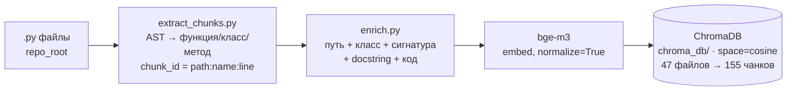
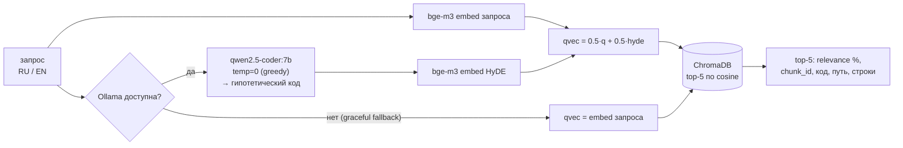

# CodeLens — семантический поиск по Python-коду (RU + EN)

Задаёшь вопрос на естественном языке (русском или английском) — система возвращает
top-5 наиболее релевантных фрагментов кода (функция / класс / метод) с подсветкой
синтаксиса, процентом релевантности и точным `chunk_id`. Решение Кейса 3 «CodeLens RAG»
(2-й этап чемпионата ГК «Ростелеком», направление ИИ).

**Метрика:** Precision@5 = **0.800** на официальном `eval_questions.json` (15 вопросов) /
**0.831** на расширенном наборе (71 вопрос). Тёплая latency ретрива ≈ **27 мс** (p50).
Всё детерминировано (HyDE temperature=0, greedy).

---

## 1. Архитектура

Гранулярность чанка — **одна функция / класс / метод**, извлекаемая детерминированным
AST-обходом. Текст, который реально эмбеддится, — не голый код, а **обогащённый**
(путь файла, родительский класс, сигнатура, docstring, затем код): это закрывает разрыв
«вопрос на естественном языке ↔ имена в коде». На стороне запроса работает **HyDE**:
локальная LLM генерирует гипотетический Python-код по вопросу, его эмбеддинг усредняется
с эмбеддингом запроса (mix, равные веса) — так RU/EN-вопрос приближается к коду в едином
векторном пространстве. Хранилище — **ChromaDB** (косинусное пространство).

### Индексация (`python index.py <папка>`)



### Поиск (`search.py`, используется в `app.py`)



### Компоненты

| Файл | Роль |
|---|---|
| [extract_chunks.py](extract_chunks.py) | Корректный AST-экстрактор. Чанк = функция/класс/метод; `chunk_id = {path}:{name}:{start_line}`, для метода `name = ClassName.method`. Ручная рекурсия `iter_child_nodes` (не `ast.walk`) — без задвоения методов. |
| [enrich.py](enrich.py) | Канонический enrichment чанка (путь + класс-родитель + сигнатура + docstring + код). Единственный источник правды; его переиспользуют и индексатор, и эксперименты. |
| [index.py](index.py) | Строит коллекцию ChromaDB: `обход .py → extract_chunks → enrich → bge-m3 → ChromaDB`. Идемпотентен (пересоздаёт коллекцию). |
| [search.py](search.py) | Боевое поисковое ядро: `search(query, top_k=5, use_hyde=True)`. HyDE temp=0 + mix, graceful fallback при недоступной Ollama, кэш HyDE-генераций, разбивка latency. |
| [app.py](app.py) | Streamlit-UI: вкладка 🔎 Поиск (карточки с `st.code(language="python")`, relevance %, latency) и вкладка 📊 Метрики (живой прогон P@5 + срезы). |

**Модели:** эмбеддинги — `BAAI/bge-m3` (мультиязычная, код-aware); HyDE/LLM — `qwen2.5-coder:7b`
через локальную Ollama. Векторная БД — ChromaDB (persistent, `chroma_db/`, `hnsw:space=cosine`).

---

## 2. Запуск (две команды)

**Окружение** — Python 3.12 (conda env `codelens`):

```bash
conda create -n codelens python=3.12 -y
conda activate codelens
pip install -r requirements.txt
```

**Команда 1 — индексация** (строит ChromaDB из папки с кодом; по умолчанию `gymhero`):

```bash
python index.py gymhero
# 47 файлов .py → 155 чанков, ~19 c на GPU (RTX 4080 mobile), space=cosine
```

**Команда 2 — приложение** (поднимает UI с поиском и страницей метрик):

```bash
streamlit run app.py
```

Заметки:
- **Модели качаются при первом запуске** в `~/.cache/huggingface/` (bge-m3 ≈ 2.3 ГБ).
  Прогрейте заранее, не в момент демо.
- **HyDE** требует запущенной Ollama с `qwen2.5-coder:7b` (`ollama pull qwen2.5-coder:7b`).
  Если Ollama недоступна — поиск **не падает**: `search.py` делает graceful fallback на
  эмбеддинг только запроса (без HyDE).
- `sslfix.py` импортируется первым в `index.py`/`search.py` и автоматически чинит битый
  `SSL_CERT_FILE` (иначе на части окружений падает загрузка моделей с HuggingFace).

---

## 3. Пять примеров запросов (реальные прогоны `search()`)

Все результаты ниже получены боевым `search(use_hyde=True)` на текущей базе (HyDE temp=0).

**1. RU · easy — «где хранится секретный ключ для подписи токенов?»**
```
1. [65.3%]  gymhero/api/dependencies.py:get_token:35      (function)
2. [62.8%]  gymhero/schemas/auth.py:Token:6               (class)
```

**2. RU · medium — «как проверить, активен ли пользователь?»**
```
1. [85.1%]  gymhero/crud/user.py:UserCRUDRepository.is_active_user:38   (method)
2. [73.7%]  gymhero/api/dependencies.py:get_current_active_user:82      (function)
```

**3. RU · hard — «как устроена цепочка зависимостей при проверке прав суперпользователя на уровне роутера?»**
```
1. [70.0%]  gymhero/crud/user.py:UserCRUDRepository.is_super_user:25    (method)
2. [67.9%]  gymhero/api/dependencies.py:get_current_superuser:105       (function)
```

**4. EN · medium — «how to create a new training plan?»**
```
1. [76.9%]  gymhero/crud/training_plan.py:TrainingPlanCRUD.add_training_unit_to_training_plan:11  (method)
2. [76.7%]  gymhero/crud/training_plan.py:TrainingPlanCRUD:10                                      (class)
```

**5. EN · негативный — «is there any rate limiting or throttling mechanism implemented?»**
```
1. [55.2%]  gymhero/crud/base.py:CRUDRepository.get_many_for_owner:189  (method)
2. [55.0%]  gymhero/crud/base.py:CRUDRepository.get_many:53             (method)
```
В `gymhero` rate limiting **не реализован**. Порог `NEGATIVE_THRESHOLD = 60 %` в
[search.py](search.py) ловит это: top-1 = 55.2 % < 60 % → UI показывает баннер «низкая
релевантность — возможно, функциональности нет в коде». Система не выдумывает фичу, а честно
помечает свой лучший (но слабый) ближайший по смыслу результат.

**Калибровка порога — на данных, не наугад.** Собрали top-1 relevance по 88 позитивам
(71 вопрос eval + 17 запросов `sample_queries.txt`) и 3 негативам (rate limiting / WebSocket / OAuth2):

| Группа | n | min | медиана | max |
|---|---:|---:|---:|---:|
| Позитивы — eval | 71 | 62.8 | 73.7 | 85.3 |
| Позитивы — sample | 17 | 57.2¹ | 71.3 | 85.1 |
| Негативы | 3 | 54.6 | 55.2 | 58.4 |

¹ Единственный позитив ниже 62 % — запрос *«как реализовано кеширование ответов API»*.
Кеширования в gymhero **нет**, то есть это фактически 4-й негатив, ошибочно отнесённый к
позитивам. С ним кластеры формально пересекаются на 1.2 пункта; **исключив его, зазор чистый:
негативы ≤ 58.4 %, истинный «пол» позитивов = 62.8 %** (надёжная оценка по 71 вопросу).

Порог **T = 60 %** стоит в середине этого зазора. Confusion-матрица на собранных данных:

| Истина \ Решение системы | показала результат | «не найдено» |
| --- | :---: | :---: |
| **ответ в базе ЕСТЬ** (88) | 87 ✓ | 1 (тот самый «кеширование») |
| **функции НЕТ** (3) | 0 | 3 ✓ |

То есть T=60 ловит **все 3 негатива (3/3)** при **ложных «не найдено» на позитивах 1.1 %**, и
остаётся **ниже** самого слабого легитимного позитива (RU-easy «секретный ключ», 65.3 %) —
порог обобщается, а не подогнан под демо. Прежнее значение 40 % было ниже негативов и баннер
не срабатывал вовсе.

---

## 4. Обоснование стратегии чанкинга

> Чанк = одна функция/класс/метод, потому что это минимальная самостоятельная семантическая
> единица Python-кода: у неё есть имя, сигнатура и docstring, она индексируется AST
> детерминированно и совпадает с гранулярностью, в которой разработчик задаёт вопрос
> («где проверяется суперпользователь»). Крупные функции мы дополнительно обогащаем
> сигнатурой и контекстом; файловую гранулярность отвергли — она смешивает несколько
> ответственностей в один вектор и роняет precision.

AST-детерминизм — не просто удобство: экстрактор из [extract_chunks.py](extract_chunks.py)
даёт **дельту 0 строк на всех 30 эталонных `chunk_id`** из `eval_questions.json` (калибровка
30/30), то есть формат `chunk_id` гарантированно совместим со скорером организаторов. Выбор
function-level + enrichment подтверждён экспериментом: enrichment — **единственный
статистически значимый прирост** в ablation (см. §6 и research report).

---

## 5. Метрики

Считаются скрипт-совместимо с организаторским [score.py](score.py)
(`Precision@5 = matched / min(5, len(correct))`, сравнение `chunk_id` с допуском ±2 строки).

| Набор | Вопросов | Precision@5 |
|---|---:|---:|
| **Официальный** `eval_questions.json` (организаторы) | 15 | **0.800** |
| Расширенный `eval/eval_extended.json` (наш, `gen_eval.py`) | 56 | 0.839 |
| **Всего** | 71 | **0.831** |

**Срезы (на 71 вопросе, боевая конфигурация):**

| По сложности | P@5 | | По языку | P@5 |
|---|---:|---|---|---:|
| easy (23) | 0.978 | | ru (36) | 0.898 |
| medium (34) | 0.765 | | en (35) | 0.762 |
| hard (14) | 0.750 | | | |

**Latency** (тёплый процесс, 15 последовательных запросов):

| Путь | p50 | p95 |
|---|---:|---:|
| Ретрив (embed + поиск в ChromaDB) | ~24 мс | ~116 мс |
| Полный путь, HyDE из кэша | ~27 мс | ~47 мс |
| Живая HyDE-генерация (cache miss, Ollama) | +0.5–1.6 c | |

Требование ТЗ (≤ 3 c) выполняется с большим запасом. **Детерминизм:** HyDE работает на
`temperature=0` (greedy) — P@5 **идентичен между прогонами** (`run1 ≡ run2`), результаты
воспроизводятся вживую без замороженных артефактов.

---

## 6. Что НЕ сработало (и почему отклонено)

Исследовали 5 техник; приняли только те, что дают **робастный** прирост на held-out
(71 вопрос), а не на шумном наборе из 15. Деталь, доверительные интервалы и paired-bootstrap —
в research report.

| Подход | P@5 (71) | Решение |
|---|---:|---|
| bge-m3 + enriched | 0.782 | ✅ **принят** — единственный статзначимый прирост (Δ=+0.052, 95 % CI [+0.012, +0.099]) |
| + HyDE-mix *(продакшен)* | 0.822* | ✅ **принят** — стабилен на всех подвыборках, не вредит агрегату |
| + cross-encoder rerank | 0.819 | ❌ отклонён — в пределах шума, разный знак по срезам, +568M модель и latency |
| + BM25-гибрид (w=0.2) | 0.782 | ❌ отклонён — переобучен на 15-q тюнинге, на held-out теряет весь прирост HyDE |
| multi-HyDE (×3 сэмпла) | 0.819 | ❌ отклонён — нет прироста vs single, ×3 стоимость |

\* `0.822` — точечная оценка в ablation-harness на замороженных temp=0.2 генерациях; боевая
конфигурация на **живой** HyDE temp=0 даёт **0.831** на 71 / **0.800** на офиц.15 (см. §5).

---

*Кодовая база для индексации — open-source FastAPI-приложение
[gymhero](https://github.com/JakubPluta/gymhero) (MIT). Описание датасета и формата `chunk_id`
от организаторов — в [DATASET.md](DATASET.md).*
