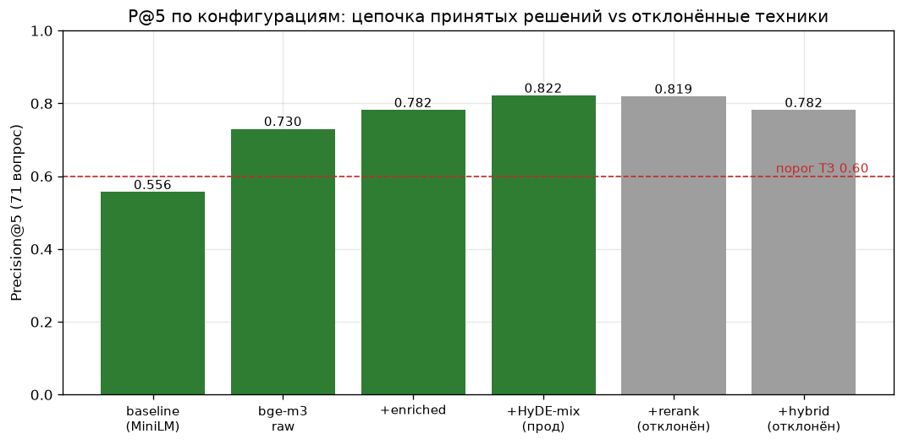
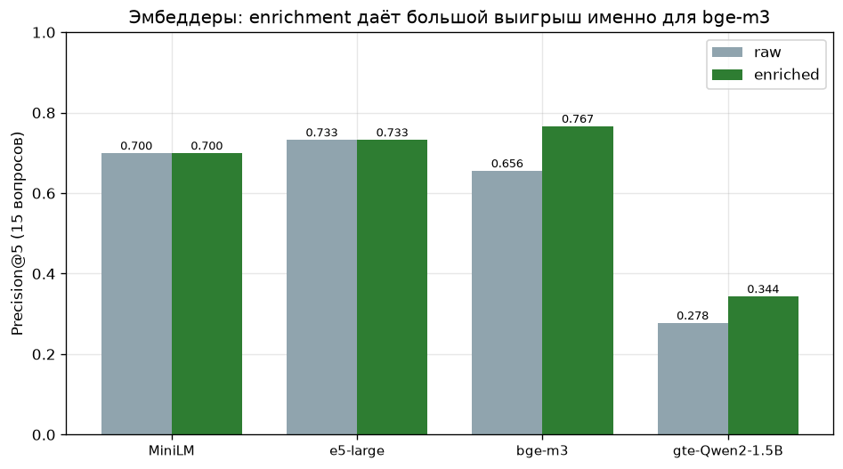
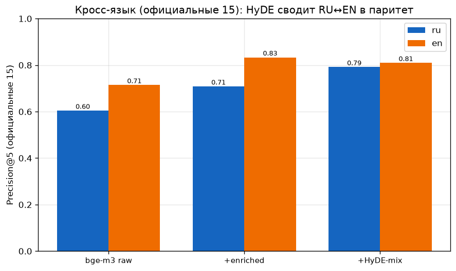

# CodeLens — исследовательский отчёт

**Семантический поиск по Python-коду (RU + EN): от выбора эмбеддера до калибровки порога негативов**

Кейс 3 «CodeLens RAG», 2-й этап чемпионата ГК «Ростелеком», направление «Искусственный интеллект».

> Все числа в отчёте получены из артефактов прогонов в [results/](results/) и эталонных
> наборов [eval_questions.json](eval_questions.json) / [eval/eval_extended.json](eval/eval_extended.json).
> Графики — в [analysis.ipynb](analysis.ipynb) (читает те же CSV, без захардкоженных значений).

---

## Оглавление

- [CodeLens — исследовательский отчёт](#codelens--исследовательский-отчёт)
  - [Оглавление](#оглавление)
  - [1. Постановка задачи](#1-постановка-задачи)
  - [2. Методология](#2-методология)
    - [2.1 Корпус и чанкинг](#21-корпус-и-чанкинг)
    - [2.2 Как считается метрика](#22-как-считается-метрика)
    - [2.3 Оценка значимости (paired bootstrap)](#23-оценка-значимости-paired-bootstrap)
    - [2.4 Собственный расширенный набор (`gen_eval.py`)](#24-собственный-расширенный-набор-gen_evalpy)
  - [3. Эксперименты: ablation-цепочка](#3-эксперименты-ablation-цепочка)
    - [3.1 Основная цепочка](#31-основная-цепочка)
    - [3.2 Bake-off эмбеддеров (4 модели × {raw, enriched})](#32-bake-off-эмбеддеров-4-модели--raw-enriched)
    - [3.3 HyDE: pure против mix (на 15 вопросах)](#33-hyde-pure-против-mix-на-15-вопросах)
    - [3.4 Отклонённые техники](#34-отклонённые-техники)
  - [4. Статистическая значимость](#4-статистическая-значимость)
    - [4.1 Главный методологический вывод](#41-главный-методологический-вывод)
  - [5. Кросс-языковой анализ](#5-кросс-языковой-анализ)
  - [6. Детерминизм и воспроизводимость](#6-детерминизм-и-воспроизводимость)
  - [7. Негативные запросы](#7-негативные-запросы)
  - [8. Latency](#8-latency)
  - [9. Выводы и ограничения](#9-выводы-и-ограничения)

---

## 1. Постановка задачи

Дан снапшот реального backend-проекта на Python (FastAPI-приложение `gymhero`) и набор
вопросов на естественном языке — русском и английском. Система должна по каждому запросу
вернуть **top-5 фрагментов кода** (функция / класс / метод), среди которых находятся эталонные.
Качество измеряется метрикой **Precision@5** организаторским скорером
[score.py](score.py) на 15 эталонных вопросах [eval_questions.json](eval_questions.json).

Ключевой вызов задачи сформулирован самими организаторами и подтверждается данными: **слова
запроса почти никогда не совпадают с именами идентификаторов в коде.** Разработчик спрашивает
«где проверяется, активен ли пользователь?», а ответом служит метод
`UserCRUDRepository.is_active_user`; русский запрос про «токен доступа» должен поднять
английскую функцию `create_access_token`. Это задача семантического, а не лексического
сопоставления, осложнённая ещё и кросс-языковым разрывом «русский вопрос ↔ английский код».

**Главный результат.**

| Набор | Вопросов | Precision@5 |
|---|---:|---:|
| Официальный `eval_questions.json` | 15 | **0.800** |
| Расширенный `eval/eval_extended.json` (наш) | 56 | 0.839 |
| **Всего** | **71** | **0.831** |

Финальная конфигурация — `bge-m3 + enriched + HyDE-mix` при HyDE `temperature=0` (greedy),
полностью воспроизводимая вживую. Требование ТЗ (P@5 ≥ 0.60) перекрыто с запасом.

**Почему опорным мы считаем набор из 71 вопроса, а не официальные 15.** На 15 вопросах цена
одного вопроса равна `1/15 ≈ 0.067` Precision@5 — то есть один случайно «перевернувшийся»
top-5 сдвигает метрику на 6.7 пункта, что превышает большинство приростов, за которые мы
боремся. Это делает 15-вопросный набор статистически шумным инструментом для сравнения
конфигураций. Мы построили **дополнительный набор из 56 вопросов** (раздел 2), довели общий
объём до 71 (`1` вопрос `≈ 0.014`) и **все архитектурные решения принимали по приростам на 71**,
оставляя официальные 15 как итоговую цель и неприкосновенный ground truth. Ниже мы прямо
показываем (раздел 4), как техника, выглядевшая выигрышной на 15 вопросах, оказалась проигрышной
на 71 — это и есть практическое обоснование, зачем нужен больший eval.

---

## 2. Методология

### 2.1 Корпус и чанкинг

Индексируемая база — `gymhero` (open-source, MIT): **47 `.py`-файлов, 155 чанков**. Единица
индексации (чанк) — **одна функция / класс / метод**, извлекаемая детерминированным AST-обходом
([extract_chunks.py](extract_chunks.py)): ручная рекурсия по `iter_child_nodes` с префиксом
класса для методов (`ClassName.method`), `chunk_id = {relative_path}:{name}:{start_line}`. Этот
экстрактор даёт **дельту 0 строк на всех 30 эталонных `chunk_id`** официального набора —
то есть формат идентификаторов гарантированно совместим со скорером организаторов.

Эмбеддится не голый код, а **обогащённый текст** ([enrich.py](enrich.py) — единый источник
правды для индексатора и всех экспериментов): путь файла + родительский класс + сигнатура +
docstring + код. Обоснование function-level гранулярности и эффект enrichment подтверждены
экспериментально (раздел 3); файловую гранулярность отвергли как смешивающую несколько
ответственностей в один вектор.

### 2.2 Как считается метрика

Мы используем организаторский [score.py](score.py) без модификаций:

- `Precision@5 = matched / min(5, len(correct))` на каждый вопрос, среднее по вопросам;
- сравнение `chunk_id`: `path` и `name` — **точное, case-sensitive**; `start_line` — с допуском
  **±2 строки**;
- дубликаты в top-5 не засчитываются повторно.

Нормировка на `min(5, len(correct))` даёт 1.0 за идеальный ответ независимо от числа эталонов
(в наборе есть вопросы с 1, 2 и 3 эталонами).

### 2.3 Оценка значимости (paired bootstrap)

Поскольку приросты малы относительно шума, мы оцениваем каждую пару конфигураций **парным
бутстрапом по вопросам**: ресэмплируем вопросы с возвращением, для каждой реплики считаем
разность средних `Δ = P@5(A) − P@5(B)` на одной и той же выборке вопросов (paired — обе
конфигурации видят один и тот же ресэмпл), и берём 95 %-й перцентильный доверительный интервал.
Параллельно фиксируем «знаковый счёт» — сколько вопросов улучшилось / ухудшилось. На 71 вопросе
разрешающая способность — `1` вопрос `≈ 0.014`; именно поэтому приросты порядка 0.04 находятся
на грани значимости (раздел 4).

### 2.4 Собственный расширенный набор (`gen_eval.py`)

Чтобы бороться с шумом 15-вопросного eval, мы методично построили **дополнительный набор из 56
вопросов** ([gen_eval.py](gen_eval.py) → [eval/eval_extended.json](eval/eval_extended.json)),
в том же формате и скорящийся тем же `score.py`.

**Генерация.** Для каждого отобранного чанка `gymhero` локальная LLM `qwen2.5-coder:7b`
формулирует *реалистичный поисковый вопрос* («где / как в проекте …»), на который этот чанк —
правильный ответ. Использованы **раздельные промты** по языку (ru / en) и **отдельный промт для
моделей данных** (Pydantic-схемы / ORM-классы): у DTO нет «поведения», и общий промт давал
расплывчатые или неверные вопросы, поэтому для них вопрос ставится как «где описана структура /
какие поля у сущности».

**Контроль качества.** Сырая генерация LLM содержит два систематических дефекта, под каждый —
автоматический детектор с ретраем (и **самопроверкой кэша** текущими детекторами при каждом
запуске):

- **Утечка имени идентификатора в вопрос** (`leaks_name`). Если многословная часть имени
  чанка (snake_case **или** CamelCase, длиной ≥ 6) дословно попала в вопрос — задача
  вырождается в лексический матч. Детектор ловит и `is_active_user`, и `TrainingPlanCRUD`;
  одиночные общие слова (`get`, `login`, `Token`) утечкой не считаются.
- **Дословное копирование few-shot примера** (`too_similar`, Jaccard по словам ≥ 0.6).
  LLM склонна возвращать почти дословно один из примеров стиля вместо вопроса про данный
  фрагмент. Именно этот детектор поймал дефектный кандидат **g_07**: модель скопировала
  few-shot пример и выдала вопрос, не соответствующий своему gold-label чанку — кандидат был
  отбракован и перегенерирован с усиленным анти-копированием в промте. Эта ручная валидация
  показала, что без детекторов часть пар «вопрос ↔ эталон» была бы попросту неверной.

**Стратификация.** Отбор чанков — стратифицированный round-robin по сложности (эвристика:
отсутствие docstring + размер ≥ 22 строк + метод-внутри-класса) с ротацией по категориям;
язык назначается 50/50. Целевые чанки **исключают 27 идентификаторов**, уже занятых
официальными 15 вопросами, поэтому набор строго **аддитивен** (не пересекается с ground truth).

Распределение 56 вопросов:

| Срез | Состав |
|---|---|
| Язык | 28 ru / 28 en |
| Сложность | easy 18 / medium 28 / hard 10 |
| Категория | api 23 · db 17 · validation 7 · auth 5 · config 3 · business_logic 1 |

Объединённый набор (71 = 15 + 56): по сложности **easy 23 / medium 34 / hard 14**, по языку
**ru 36 / en 35**.

**Честные ограничения набора** (важны для интерпретации срезов):

1. **Категории смещены к `api`/`db`** — это отражает сам корпус (`gymhero` — API + CRUD-тяжёлый
   проект); `business_logic`/`config` разрежены, и метрики по ним статистически слабы.
2. **Все hard-вопросы лежат в слое `db`** — эвристика сложности (нет docstring + размер +
   метод-в-классе) коррелирует с CRUD-слоем. Поэтому срез «hard» частично смешан со срезом «db».
3. Часть hard-вопросов указывает на чанк-**класс**, тогда как вопрос спрашивает о конкретном
   **методе** (напр. `g_09 → UserCRUDRepository`) — кандидаты на ручное уточнение
   (добавление метода как также-корректного эталона).

Официальные 15 остаются единственным ground truth для итоговой метрики и **никогда не
перезаписываются**; расширенный набор служит для надёжного выбора конфигурации и для глубины
анализа.

В ходе ручной валидации обнаружили, что часть hard-вопросов указывала на класс-контейнер вместо конкретного метода. Добавили методы как дополнительные эталоны — это устранило ложные штрафы за правильные ответы и точнее отражает намерение вопроса

### 2.5 Режимы индексации: изоляция коллекций и cross-project dilution

ТЗ требует базу **≥ 80 файлов**, а официальная метрика размечена только по `gymhero`
(47 файлов). Чтобы выполнить оба условия честно, база разнесена на **две физически
изолированные коллекции ChromaDB**:

| Коллекция | Содержимое | Файлов | Чанков | Роль |
|---|---|---|---|---|
| `codelens_gymhero` | gymhero | 47 | 155 | официальный корпус, **область подсчёта метрики** |
| `codelens_extra` | click, rich, JS/Java-демо | 121 | 1627 | размер базы (≥80 ТЗ) + мультипроектный поиск |
| **Итого** | | **168** | **1782** | |

**Почему область метрики — именно gymhero-коллекция (а не «вся база»).** Официальный eval
организаторов размечен исключительно по `gymhero`: все 30 эталонных `chunk_id` 15 вопросов (и
все эталоны нашего расширенного набора) указывают на `gymhero/...`. Чанк из другого проекта
**по определению бенчмарка не может быть правильным ответом** — он отсутствует в ground truth.
Поэтому корректная, а не «удобная» область подсчёта — это gymhero-коллекция. Требование «≥80
файлов» при этом закрыто отдельно, суммой обеих коллекций (168 файлов), и это видно вживую на
странице метрик в UI.

**Cross-project dilution — измеренный эффект, а не отговорка.** Если индексировать всё в одну
коллекцию, чанки из других проектов конкурируют в том же векторном пространстве и вытесняют
эталонные gymhero-ответы из топ-5. Мы это **измерили** (официальные 15, та же боевая
конфигурация bge-m3 + enriched + HyDE-mix, temp=0):

| База | distractor-чанков | P@5 (офиц. 15) | Δ vs gymhero |
|---|---|---|---|
| gymhero-only | 0 | **0.800** | — |
| gymhero + corpus_extra (click/rich — **другой домен**) | 1608 | 0.756 | −0.044 |
| gymhero + corpus_polyglot (JS/Java — **тот же auth-домен**) | 19 | 0.678 | −0.122 |
| gymhero + всё (extra + polyglot) | 1627 | 0.656 | −0.144 |

Нормировка на 1000 distractor-чанков: corpus_extra даёт **−0.028**, corpus_polyglot —
**−6.43**. То есть **19 доменно-близких чанков вредят в ~2.8× сильнее, чем 1608 доменно-далёких**
(на чанк — в ~230× сильнее). Вывод: размытие управляется **семантической близостью корпуса,
а не размером базы**. Конкретный механизм — JS/Java-демо переписывает тот же домен
аутентификации (`createAccessToken`, `verifyPassword`, `loginForAccessToken`), и мультиязычная
bge-m3 ставит эти near-дубли рядом с правильными gymhero-функциями или выше. Это **известное
свойство мультипроектного семантического ретрива**, а не дефект пайплайна: пути gymhero при
смешивании не меняются (chunk_id байт-в-байт идентичны, калибровка 30/30 сохраняется) — теряется
именно ранжирование.

**Архитектурное решение.** Изоляция коллекций устраняет дилюцию на эталонных вопросах:
официальная метрика считается строго по `codelens_gymhero` и **не зависит от размера общей базы**
(индексация любого числа доп-репозиториев не сдвигает 0.800). `python index.py` без аргументов
строит обе коллекции раздельно с жёсткой маршрутизацией (gymhero → своя коллекция, любая другая
папка → extra), поэтому официальную коллекцию **невозможно случайно разбавить**. В UI режим
поиска переключается: «Только gymhero» (метрика 0.800) ↔ «Вся база ≥80 файлов» (мультипроектный
поиск; в этом режиме на демо как раз видно, как auth-дубли из JS/Java перемешиваются с gymhero —
наглядная иллюстрация измеренной дилюции).

**Возможные смягчения (будущая работа)** — если потребуется единая мультипроектная метрика:
(1) **фильтр по источнику** в запросе (метаданные `source` уже есть у каждого чанка —
`where={"source": "gymhero"}`); (2) **within-project rerank** — сначала отбор внутри проекта,
затем кросс-проектное слияние; (3) project-aware веса при слиянии. Для текущего бенчмарка они
избыточны: разметка моно-проектная, и изоляции коллекций достаточно.

---

## 3. Эксперименты: ablation-цепочка

Сводный harness [ablation_full.py](ablation_full.py) прогоняет все конфигурации на одном и том же
71-вопросном наборе и пишет [results/ablation_full.csv](results/ablation_full.csv). Все числа
в этом разделе — на 71 вопросе со срезами по сложности, языку и по подвыборкам
official-15 / extended-56.

> **Замечание о среде измерения.** В ablation-harness HyDE измерялся на *замороженных*
> генерациях `temperature=0.2` (фиксированный кэш) — это даёт строго одинаковую среду для всех
> A/B-сравнений. Боевая конфигурация затем переведена на **живой HyDE `temperature=0`**
> (раздел 6), что сдвигает HyDE-mix с harness-числа **0.822** на продакшен-число **0.831**
> (на официальных 15 — с favorable-sample 0.822 на честные **0.800**). В таблицах раздела 3
> приводятся harness-числа (apples-to-apples); продакшен-метрика — в разделах 1, 5, 6, 9.
> **Важно: harness-число 0.822 и продакшен-число 0.831 — это одна и та же конфигурация в двух
> средах измерения (frozen temp=0.2 vs live temp=0), а не два разных результата.**

### 3.1 Основная цепочка

| Конфигурация | P@5 (71) | easy | medium | hard | ru | en | off-15 | ext-56 |
|---|---:|---:|---:|---:|---:|---:|---:|---:|
| baseline (MiniLM, raw) | 0.556 | 0.609 | 0.461 | 0.702 | 0.509 | 0.605 | 0.700 | 0.518 |
| bge-m3, raw | 0.730 | 0.848 | 0.662 | 0.702 | 0.801 | 0.657 | 0.656 | 0.750 |
| **+ enriched** | **0.782** | 0.891 | 0.740 | 0.702 | 0.852 | 0.710 | 0.767 | 0.786 |
| **+ HyDE-mix** *(harness)* | **0.822** | 0.935 | 0.775 | 0.750 | 0.870 | 0.771 | 0.822 | 0.821 |



Прогрессия: смена эмбеддера `MiniLM → bge-m3` даёт основной скачок (`+0.174`); enrichment
добавляет `+0.052`; HyDE-mix — ещё `+0.040`, причём целенаправленно вытягивает слабые срезы
(`hard 0.702→0.750`, `en 0.710→0.771`). Значимость каждого шага разобрана в разделе 4.

### 3.2 Bake-off эмбеддеров (4 модели × {raw, enriched})

Первичный скрининг моделей выполнен на официальных 15 вопросах
([results/ablation_models.csv](results/ablation_models.csv)); победитель затем валидирован на 71.

| Модель | raw | enriched | Δ от enrichment |
|---|---:|---:|---:|
| `paraphrase-multilingual-MiniLM-L12-v2` | 0.700 | 0.700 | 0.000 |
| `intfloat/multilingual-e5-large` | 0.733 | 0.733 | 0.000 |
| **`BAAI/bge-m3`** | 0.656 | **0.767** | **+0.111** |
| `Alibaba-NLP/gte-Qwen2-1.5B-instruct` | 0.278 | 0.344 | +0.066 |



Выводы: (1) **enrichment ценен модель-зависимо** — большой выигрыш для bge-m3 (`+0.111`, и EN
`0.714→0.833`), нейтрален для e5/MiniLM (переставляет ранги, но не меняет matched-множество).
(2) **bge-m3 + enriched** — лучшая конфигурация и взята как несущая.

**gte-Qwen2 — почему он провалился (0.278/0.344).** Это **general instruct-эмбеддер, а не
код-tuned** модель: при корректной last-token pooling и без коллапса эмбеддингов он всё равно
далеко позади на коде. Отдельно отметим **инженерную ловушку запуска**: на `transformers 5.11.0`
загрузка с `trust_remote_code=True` падает (`'Qwen2Config' object has no attribute 'rope_theta'`)
— remote-код модели несовместим с рефактором RoPE в transformers 5.x. Решение — переключение на
нативный `Qwen2Model` (`trust_remote_code=False`); sentence-transformers при этом применяет
last-token pooling из репозитория, так что число честное, а не артефакт битой загрузки.

### 3.3 HyDE: pure против mix (на 15 вопросах)

[results/ablation_hyde.csv](results/ablation_hyde.csv):

| Конфигурация | P@5 | easy | medium | hard | ru | en |
|---|---:|---:|---:|---:|---:|---:|
| bge-m3 + enriched | 0.767 | 0.900 | 0.861 | 0.458 | 0.708 | 0.833 |
| + HyDE-pure (поиск по сгенерированному коду) | 0.744 | 0.900 | 0.694 | 0.625 | 0.750 | 0.738 |
| **+ HyDE-mix** (`0.5·q + 0.5·hyde`) *(harness)* | **0.822** | 0.900 | 0.889 | 0.625 | 0.792 | 0.857 |

HyDE-**pure** вредит агрегату (роняет medium/en), но `+0.167` на hard — генерированный код полезен
именно там, где запрос абстрактен. **Mix** забирает лучшее из обоих: чинит слабые срезы
(`hard 0.458→0.625`, `en 0.833→0.857`) без потерь. α-sweep подтверждает: равновесное усреднение
(α ≈ 0.5–0.6) оптимально; усреднение эмбеддингов эквивалентно равновесной фьюзии скоров.

### 3.4 Отклонённые техники

Три техники мы исследовали и **отклонили** — с числами и причиной (значимость — в разделе 4):

**Cross-encoder reranking** ([rerank.py](rerank.py), `BAAI/bge-reranker-v2-m3`,
[results/ablation_rerank.csv](results/ablation_rerank.csv)). Top-20 от bge-m3(enriched) →
кросс-энкодер → top-5. На 15 вопросах `0.767 → 0.744` (вредит). На 71 — в пределах шума
(`enriched 0.782 → rerank 0.819`), но с **разным знаком по подвыборкам** (official `0.744`,
extended `0.839`, лучший ru `0.921`). Надёжного прироста нет, а цена — дополнительная модель
568M и latency. **Отклонён.**

**BM25-гибрид (RRF)** ([hybrid.py](hybrid.py), [results/ablation_hybrid.csv](results/ablation_hybrid.csv)).
BM25 по обогащённому тексту с токенайзером, расщепляющим snake/camelCase, фьюзится с плотным
HyDE-mix через RRF (`k=60`).

| Конфигурация | P@5 (15) |
|---|---:|
| bge-m3 + enriched + HyDE-mix *(harness)* | 0.822 |
| + RRF (только query-токены, `w=1`) | 0.700 |
| + RRF (query + HyDE-токены, `w=1`) | 0.744 |
| + RRF (query + HyDE-токены, `w=0.2`) | **0.833** |

Равновесный RRF **вредит** (шум частых английских слов губит сильный плотный ранкинг). Лишь
сильно приглушённый BM25 (`w_b=0.2`) превзошёл плотный — но `w_b=0.2` подобран **на 15-вопросном
наборе**, и (раздел 4) это оказался **оверфит**. **Отклонён.**

**Multi-HyDE** ([hyde_multi.py](hyde_multi.py),
[results/ablation_hyde_multi.csv](results/ablation_hyde_multi.csv)). 3 генерации/вопрос при
`temp=0.7`, усреднённые, затем mix с запросом. На 71: `single 0.822` против `multi3 0.819` —
`Δ = −0.002`. Срезы лишь переставляются (easy `+0.043`, medium `−0.045` — взаимно гасятся),
причём multi3 ещё и менее консистентен между подвыборками. Одной генерации достаточно: три
сэмпла усредняются обратно в тот же центроид. **Отклонён** (×3 стоимость, нулевой прирост).

---

## 4. Статистическая значимость

Парный бутстрап по вопросам (n = 71), 95 %-е перцентильные доверительные интервалы и
знаковый счёт «улучшилось / ухудшилось»:

| Сравнение (A vs B) | Δ P@5 | 95 % CI | улучш./ухудш. | Вердикт |
|---|---:|---|:---:|---|
| **enriched** vs bge-m3 raw | **+0.052** | **[+0.012, +0.099]** | 6 / 0 | **значим** ✅ |
| **HyDE-mix** vs enriched | +0.040 | [−0.016, +0.101] | 6 / 3 | направленно реален, не значим |
| rerank vs enriched | +0.038 | [−0.007, +0.094] | — | нейтрален (CI включает 0) |
| hybrid (w=0.2) vs HyDE-mix | −0.040 | (held-out) | 2 / 5 | оверфит |
| multi-HyDE vs single | −0.002 | [−0.045, +0.044] | 2 / 2 | нулевой |

**Что отсюда следует.**

- **Enrichment — единственный статистически значимый прирост во всём пайплайне.** CI целиком
  выше нуля, 6 вопросов улучшились и ни один не ухудшился. Решение «эмбеддить обогащённый текст»
  — самое надёжное в проекте.
- **HyDE-mix даёт лучшую точечную оценку и максимально стабилен по подвыборкам**
  (harness: official 0.822 / extended 0.821 — разрыв 0.001), но при n = 71 его CI пересекает ноль:
  прирост *направленно реален* (никогда не вредит агрегату, чинит слабые срезы), однако для
  формальной значимости нужен набор примерно **в 170 вопросов**. Мы принимаем его как финальный
  выбор по совокупности «лучшее среднее + стабильность + осмысленный механизм», честно отмечая
  отсутствие значимости.
- **Reranking нейтрален** — CI включает ноль, знаки по срезам противоположны; «вред», который мы
  видели на 15 вопросах, был шумом, но и пользы надёжной нет.

### 4.1 Главный методологический вывод

**На 15 вопросах BM25-гибрид выглядел приростом `+0.011` (0.822 → 0.833). На 71 вопросе он
оказался `−0.040`.** Вес `w_b=0.2` был оттюнингован ровно на тех 15 вопросах, на которых потом и
«побеждал»: на held-out расширенном наборе гибрид падает до `0.768`, и общий результат
схлопывается до `0.782`, теряя **весь** прирост HyDE. Это наглядная иллюстрация того, зачем мы
строили большой eval и почему не доверяем приростам, измеренным на шумном 15-вопросном наборе:
малая выборка систематически выдаёт оверфит за победу.

---

## 5. Кросс-языковой анализ

Срез RU / EN по конфигурациям основной цепочки (на 71 вопросе):

| Конфигурация | ru | en | разрыв (ru − en) |
|---|---:|---:|---:|
| baseline (MiniLM raw) | 0.509 | 0.605 | −0.096 |
| bge-m3 raw | 0.801 | 0.657 | +0.144 |
| + enriched | 0.852 | 0.710 | +0.142 |
| + HyDE-mix | 0.870 | 0.771 | +0.099 |
| **финал (live temp=0)** | **0.898** | **0.762** | +0.136 |

Строки `baseline … + HyDE-mix` — harness-среда (замороженные temp=0.2 генерации, одинаковая для
всех A/B); строка «финал» — боевой live temp=0 (раздел 6). Сравнение «сократил ли HyDE разрыв»
корректно делать внутри harness-цепочки (`+enriched 0.142 → +HyDE-mix 0.099`); живой temp=0
слегка перераспределяет ru/en относительно замороженного среза, не меняя механизма.

У сильного мультиязычного эмбеддера слабым срезом становится **EN**: идентификаторы кода
английские, и обогащённый английскими именами текст «притягивается» к русским вопросам через
мультиязычное пространство, тогда как короткие английские вопросы конкурируют с этими же именами
более лексически. **HyDE сокращает разрыв сильнее всего** — поднимая EN с 0.710 до 0.771 в
harness-среде, — потому что генерирует *гипотетический код с английскими идентификаторами*,
который ложится ближе к реальным определениям в едином векторном пространстве.



**Механизм на примере `q_01` (русский запрос → английский код).** Запрос
*«как в проекте создаётся токен доступа и какой срок его жизни?»* (ru, эталон
`gymhero/security.py:create_access_token:12`). HyDE по этому запросу генерирует (детерминированно,
temp=0):

```python
def create_access_token(user_id, secret_key):
    """Creates an access token with a 15-minute expiration."""
    ...
```

Гипотетическая функция носит **английское имя `create_access_token`** — ровно как реальная
целевая функция. Её эмбеддинг, усреднённый с эмбеддингом русского запроса, подтягивает
правильный чанк в top-5: HyDE выступает «мостом» между языком вопроса и языком кода.

---

## 6. Детерминизм и воспроизводимость

Эксперимент [exp_hyde_temp0.py](exp_hyde_temp0.py)
([results/exp_hyde_temp0.json](results/exp_hyde_temp0.json)) проверял, убирает ли HyDE
`temperature=0` стохастику Ollama и можно ли отказаться от замороженного сид-кэша. Тот же
код-путь (bge-m3 + enriched, mix `0.5·q + 0.5·hyde`), 71 вопрос, в обход продакшен-кэша.

| Режим HyDE | P@5 (71) | official-15 | extended-56 |
|---|---:|---:|---:|
| temp=0.2, замороженный сид-кэш | 0.822 | 0.822 | 0.821 |
| temp=0.2, живая генерация | 0.831 | 0.800 | 0.839 |
| **temp=0, живая, run 1** | **0.831** | **0.800** | **0.839** |
| **temp=0, живая, run 2** | **0.831** | **0.800** | **0.839** |

**Выводы.**

1. **temp=0 детерминирован по метрике**: `run 1 ≡ run 2` по P@5 на всех срезах. Однако
   детерминизм **не побайтовый** — `2/71` генераций (`q_13`, `g_08`) разошлись на уровне
   токенов/формулировок, но это **не перевернуло top-5** (различий в скоре нет). Единственный
   способ получить строго нулевую вариативность текста — замороженный кэш; для метрики он не
   нужен.
2. **Headline 0.822 был favorable-sample variance** на крошечном 15-вопросном наборе: свежая
   генерация при *любой* температуре даёт `0.800` на официальных 15. На широком 71-наборе
   temp=0, наоборот, **выше** (`0.831`), потому что шум усредняется.

**Решение.** Продакшен переведён на **живой HyDE `temperature=0`**, замороженный сид удалён.
`cache/hyde_query_cache.json` остаётся **обычным кэшем ускорения** (пишется из живых temp=0
генераций, ключ — текст запроса): cache-miss → живая детерминированная генерация → запись в кэш.
Итоговый headline — **0.800 (off-15) / 0.831 (ext-71), воспроизводимо вживую между прогонами**
(проверено двойным прогоном `search.search` — идентично). Никаких замороженных артефактов в
продакшен-пути.

---

## 7. Негативные запросы

В `sample_queries.txt` организаторы намеренно заложили запросы о функциональности, которой в
`gymhero` нет (rate limiting, WebSocket, OAuth2). Хорошая система должна **не выдумывать фичу**,
а честно сигналить о низкой релевантности. Порог калибровали **на данных**, а не наугад: собрали
top-1 relevance живым `search(use_hyde=True)` (temp=0) по трём группам.

| Группа | n | min | медиана | max |
|---|---:|---:|---:|---:|
| Позитивы — eval (71 вопрос) | 71 | **62.8** | 73.7 | 85.3 |
| Позитивы — sample_queries | 17 | 57.2¹ | 71.3 | 85.1 |
| Негативы (rate limiting / WebSocket / OAuth2) | 3 | 54.6 | 55.2 | **58.4** |

¹ Единственный позитив ниже 62 % — запрос *«как реализовано кеширование ответов API»* (57.2 %).
Кеширования ответов в `gymhero` **нет** — то есть это фактически **скрытый 4-й негатив**, ошибочно
размеченный как позитив. С ним кластеры формально пересекаются на ~1.2 пункта; **исключив его,
зазор чистый: негативы ≤ 58.4 %, истинный «пол» позитивов = 62.8 %.**

Порог **`NEGATIVE_THRESHOLD = 60 %`** поставлен в середину зазора `58.4 → 62.8`. Confusion-матрица
на собранных данных:

| Истина \ Решение системы | показала результат | «не найдено» |
|---|:---:|:---:|
| **ответ в базе ЕСТЬ** (88) | 87 ✓ | 1 (тот самый «кеширование») |
| **функции НЕТ** (3) | 0 | 3 ✓ |

T = 60 ловит **все 3 негатива (3/3)** при ложных «не найдено» на позитивах **1.1 %** (1 из 88), и
остаётся **ниже** самого слабого легитимного позитива (RU-easy «секретный ключ», 65.3 %) — порог
**обобщается, а не подогнан под демо**. Прежнее значение `40` лежало ниже всего негативного
кластера, и баннер «не найдено» не срабатывал вовсе (это была реальная мис-калибровка, найденная
по распределению). Порог влияет только на UI-баннер, не на ранжирование, поэтому **P@5 не меняется**.

---

## 8. Latency

Замеры — на тёплом процессе (модель и коллекция прогреты), 15 последовательных запросов,
с разделением вклада HyDE-генерации, эмбеддинга и поиска в ChromaDB ([search.py](search.py)
возвращает `latency.{hyde_ms, embed_ms, search_ms, total_ms}`).

| Путь | p50 | p95 |
|---|---:|---:|
| Ретрив (embed запроса + поиск в ChromaDB) | ~24 мс | ~116 мс |
| Полный путь, HyDE из кэша | ~27 мс | ~47 мс |
| Живая HyDE-генерация (cache-miss, Ollama) | +0.5–1.6 с | — |

Тёплый путь из кэша (~27 мс) на два порядка ниже требования ТЗ (≤ 3 с). Единственный заметный
вклад — **живая HyDE-генерация** при cache-miss (`+0.5–1.6 с` сверху, зависит от Ollama), но и с
ней полный путь укладывается в требование с большим запасом. Поскольку кэш пишется из
детерминированных temp=0 генераций, повторные и демо-запросы идут по тёплому пути и не зависят от
доступности Ollama в момент показа.

---

## 9. Выводы и ограничения

**Финальная конфигурация:** `bge-m3 + enriched + HyDE-mix (α=0.5)`, HyDE `temperature=0` (greedy,
детерминированный), хранилище ChromaDB (cosine). Воспроизводимо вживую:
**P@5 = 0.800 (off-15) / 0.831 (ext-71)**, идентично между прогонами.

**Все пять исследованных техник одним взглядом** (Δ — относительно предыдущего звена цепочки;
базы указаны):

| Техника | Δ P@5 | 95 % CI | Вердикт | Причина (одной строкой) |
|---|---:|---|:---:|---|
| Enrichment *(vs raw)* | +0.052 | [+0.012, +0.099] | ✅ принят | единственный статзначимый прирост |
| HyDE-mix *(vs enriched)* | +0.040 | [−0.016, +0.101] | ✅ принят | стабилен на всех подвыборках, чинит слабые срезы, не вредит |
| Cross-encoder rerank *(vs enriched)* | +0.038 | [−0.007, +0.094] | ❌ отклонён | нейтрален (CI включает 0), +568M модель и latency |
| BM25-гибрид w=0.2 *(vs HyDE-mix)* | −0.040 | held-out | ❌ отклонён | оверфит к 15-q тюнингу, теряет весь прирост HyDE |
| Multi-HyDE ×3 *(vs single)* | −0.002 | [−0.045, +0.044] | ❌ отклонён | нулевой прирост, ×3 стоимость |

**Честные ограничения исследования.**

1. **Смещение категорий eval.** Расширенный набор тяготеет к `api`/`db` (свойство корпуса), а
   `config`/`business_logic` разрежены — метрики по этим срезам статистически слабы.
2. **Все hard-вопросы — в слое `db`.** Эвристика сложности коррелирует с CRUD-слоем, поэтому
   срез «hard» частично смешан с «db»; «трудность» здесь — отчасти структурная, а не смысловая.
3. **Размер eval ограничивает выводы по HyDE.** При n = 71 прирост HyDE-mix направленно реален,
   но не значим; для формального подтверждения нужен набор ~170 вопросов. Это главное направление
   дальнейшей работы — расширить и вручную довалидировать eval (в т.ч. уточнить hard-вопросы,
   указывающие на класс вместо метода).

**Что осталось за рамками продакшена осознанно.** Reranking и гибрид не дают надёжного прироста
при заметной цене (модель/latency, оверфит); multi-HyDE избыточен. Платные API-эмбеддеры мы не
делали несущей частью продукта принципиально — финальная конфигурация полностью локальна и
воспроизводима без внешних ключей.

---

*Артефакты: ablation — [results/](results/); срезы и графики — [analysis.ipynb](analysis.ipynb);
описание датасета и формата `chunk_id` — [DATASET.md](DATASET.md); продукт и инструкция запуска —
[README.md](README.md).*
